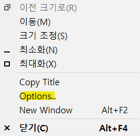

개인 컴퓨터로는 wsl에서 zsh을 사용하다가 회사 규정상 window, wsl을 동시에 사용 할수 없어 부득이하게 window를 사용하게 됐다

때문에 평소에 쓰던 zsh과는 조금 다른 bash를 사용하게 되었는데 미관상으로도 맘에 안들고 단축어도 없어서 이것저것 설정을 진행하였다

# 1. bash theme 설정하기

`git bash`를 열고 위에 우클릭해 options를 눌러준다



options window에서 theme, font등을 골라 설정해주면 된다

> 📌 만약 원하는 폰트가 없다면 다운로드해서 설정해주면 된다

# 2. bash 시작위치 변경하기

bash 바로가기 아이콘에 우클릭해 속성에 들어가서 **바로 가기**탭에 대상에 있는 `--cd-to-home`를 지우고 그 아래 **시작 위치**를 본인이 원하는 위치로 변경하면 된다

# 3. bash 단축어 설정하기

여러 디렉토리를 넘나들며 작업할 때 일일이 `$ cd ...`하는 것은 너무 비효율적이고 귀찮다

이를 해결하기 위해 단축어를 설정하는데 본인이 git을 설치한 곳으로 이동하여 `aliases.sh`를 실행해준다

내 경우에는 아래와 같은 경로이다

```sh
$ code /c/'Program Files'/Git/etc/profile.d/aliases.sh
```

> 📌 경로를 쓸 때 띄어쓰기가 있다면 `''`로 감싸주면 된다

원하는 단축어를 다음과 같이 설정해준다

```sh
alias ${단축어} = ${실제 명령어}
```

예를 들면 다음과 같다

```sh
alias work='cd /c/Users/admin/work'
alias prsn='cd /c/Users/admin/personal'
```

이제 bash에 `work`를 입력하면 work 디렉토리로 이동하고 `prsn`을 입력하면 personal 디렉토리로 이동한다

> 📌 만약 단축어를 까먹었다면 bash에 `alias`를 입력해보자

## \*references

1. [https://shlee1990.tistory.com/1030](https://shlee1990.tistory.com/1030)

2. [Git Bash: Change Default Directory](https://www.shellhacks.com/git-bash-change-default-directory/)
