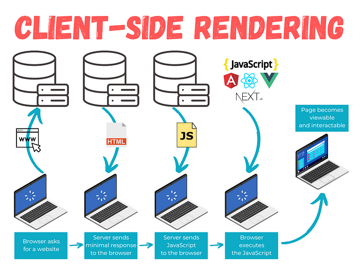

react metaframework인 `Next.js`를 본격적으로 시작하려고 마음을 먹었는데 먼저 리엑트와의 차이점과 어떤 장점이 있길래 `Next.js`를 사용하는 것인지 알아보려고 한다

## CSR

리엑트는 기본적으로 `CSR` 방식을 사용한다고 하는데 `CSR`이란 뭘까?

`CSR`을 풀어서 뜻을 확인해보면 `Client Side Rendering`

즉, _"클라이언트 측에서 렌더링을 한다"_ 를 의미한다

그렇다면 `CSR`은 어떻게 동작할까?

### CSR의 동작 과정

아래의 그림은 `CSR`의 전체적인 과정을 요약한 그림이다

가볍게 훑어보도록 하자

위 과정을 좀 더 작은 단계로 나누어 `CSR`이 어떻게 동작하는지 살펴보도록 하자

1. 사용자가 서버에게 페이지를 요청한다

2. 서버는 최소한의 HTML을 사용자에게 전달한다
   (로딩 이미지나 그에 준하는 사용자가 이해하는 것을 전달할 수도 있다)

3. 서버는 초기 HTML과 함께 필요한 js, css file을 전송한다

4. 사용자의 브라우저가 HTML 페이지를 로드하고 자바스크립트 코드를 실행한다

5. JavaScript 코드가 페이지를 렌더링하는 데 필요한 데이터를 가져오기 위해 API 또는 다른 데이터 소스에 요청을 보낸다

6. 데이터를 가져왔다면 이 데이터들을 자바스크립트 코드에 의해 브라우저에 렌더링된다

7. 이제 클릭, 트리거 등 상호작용이 가능(interactable)하고 볼 수 있는(visible) 페이지가 된다

### CSR의 장점

1. 유저 경험 향상

미리 자바스크립트 파일을 받아 실행하므로 유저의 요청에 빠르게 응답할 수 있다

2. 페이지 로드 속도 향상

최소한의 HTML을 가지고 동적으로 페이지를 만드는데 이미 자바스크립트가 실행되어 해당 페이지들에 대한 로드 준비가 되어있어 빠르게 페이지를 로드할 수 있다

3. 이슈/고려사항의 분리

프론트엔드와 백엔드의 이슈/고려사항을 분리할 수 있다

백엔드 팀은 API 혹은 DB 구축에 집중할 수 있고,

프론트엔드 팀은 UI에 집중할 수 있다

### CSR의 단점

1. SEO 최적화의 어려움

`CSR`의 경우 자바스크립트로 인해 HTML이 동적으로 생성되기 때문에 일반적인 크롤러로는 [크롤링](https://namu.wiki/w/크롤링)이 되지 않는다

최근에는 구글과 같은 곳에서는 브라우저를 동작시켜 서버로부터 자바스크립트를 받아와 실행시켜 크롤링 함으로써 `CSR`로 만들어진 사이트도 크롤링할 수 있도록 하고 있다

> chrome > inspector > lighthouse에서 SEO 점수를 확인할 수 있다

2. 처음 렌더링이 느림

사이트에 처음 접속했을 때 CSR은 모든 것을 다운받아 실행시켜 브라우저에 렌더링하므로 다른 렌더링 방식에 비해 속도가 느리다

> 추후에 접속할 때에는 브라우저가 저장한 캐시(cache)로 인해 렌더링 시간이 단축된다
>  
> 하지만 이 또한 자바스크립트 파일을 캐시로 저장해야되기 때문에 브라우저의 메모리를 많이 차지해 성능저하를 발생시킬 우려가 있다

이제 `CSR`방식을 주로 사용하는 `SPA`가 `SSR(Server Side Rendering)`이 필요한 이유

즉, `Next.js`가 사랑받는 이유에 대해 알아보자

## SPA로 구성된 웹은 왜 SSR이 필요할까?

#### References

- [What is the Client-Side Rendering and how it works](https://ferie.medium.com/what-is-the-client-side-rendering-and-how-it-works-c90210e2cd14)

- [Pros and Cons of Client-Side Rendering](https://www.pluralsight.com/guides/pros-and-cons-of-client-side-rendering)
