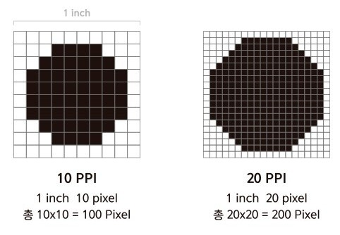
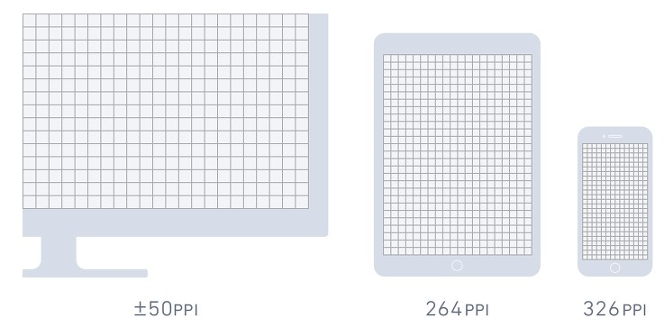
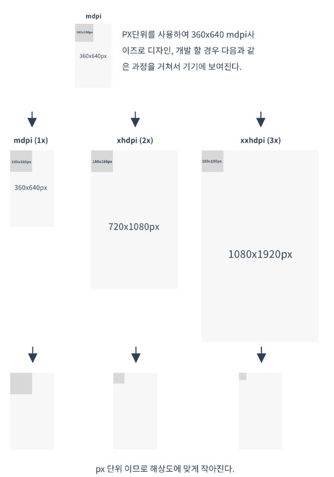
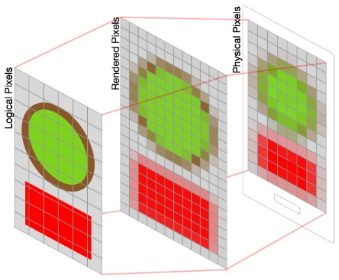
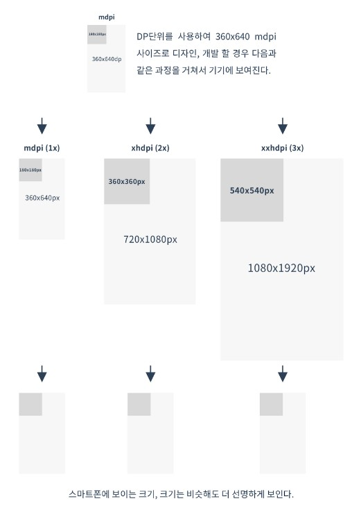

웹개발을 하다보면 대부분 픽셀(px), 그리고 상대적인 단위(rem, em, etc.)를 사용하게 되는데 앱개발에서의 단위는 이와는 조금 다른 구석이 있다

이러한 단위들(dp, sp 등)이 각각 어떤 차이점이 있는지에 대해 알아보도록 하자

# ppi(Pixel per inch)

먼저 이들의 단위를 알기 전에 ppi에 대해 짚고 넘어가야 한다

ppi란 말 그대로 1인치(inch)당 몇 개의 픽셀(pixel)로 이뤄졌는지를 나타내는 **밀도의 단위**이다

예를들어 10ppi는 1인치당 10개의 픽셀이 존재한다는 뜻이므로 2차원 평면으로 볼 때 10x10 즉, 단위 면적(1inch²)당 100개의 픽셀이 존재한다는 뜻이다

즉, 동일한 해상도라면 작은 기기일수록 더 ppi가 높으며 이는 더 선명한 화면을 구현한다는 뜻이다

# Pixel

픽셀(pixel)은 Picture + Element의 합성어로 색을 구성하는 최소 단위를 말한다

이는 절대적인 크기를 의미하지 않으며 따라서 각 기기마다 1px의 크기는 모두 다를 수 있다

위 그림에서 `mdpi`에서 `xxhdpi`로 갈수록 동일한 픽셀(180 x 180)이 차지하는 영역의 크기가 줄어들고 있다

즉, 고해상도 기기에서의 픽셀의 크기가 저해상도에서의 픽셀의 크기보다 작다 (모니터 해상도를 조절할 때 아이콘 등이 커지고 작아진 경험이 있을 것이다)

## 🍪물리픽셀(Physical pixel)과 논리픽셀(Logical pixel)

활자 크기를 재는 단위로 파이카라는게 있다

1파이카는 1/6인치이며, 우리가 쓰는 폰트사이즈 12포인트에 해당한다

즉 1/72인치는 1포인트이며 이게 우리가 전통적으로 사용하는 **웹환경(72ppi)** 이다

하지만 포인트는 현실 세계의 길이 단위인데 이 단위를 기계의 픽셀이라는 점의 단위로 표현하면서 문제가 발생한다

포인트가 픽셀로 렌더링되는 과정(rasterization)을 거치게 되는데 이를 1x(1:1)로 전환하면 아래와 같이 선명하지 않은 화면을 얻는다

이를 막기 위해서 더크게(2x, 3x, ...) 래스터라이제이션을 하여 다운샘플링(down sampling)을 하여 밀도(ppi)를 높이는 방식을 사용한다

# DP(Density Independent Pixel)

주로 안드로이드(android)에서 쓰이는 단위로 **픽셀과 상관없이 독립적인 크기를 가진다**

위 예시를 보면 가로길이의 절반크기의 정사각형을 볼 수 있다

픽셀을 아무리 늘려도 dp가 차지하는 공간은 동일하다

즉, mdpi보다 xhdpi가, xhdpi보다 xxhdpi가 고해상도임을 알 수 있다

## \*references

1. [What is the Difference Between Screen Size and Screen Resolution?](https://www.itsasap.com/blog/screen-size-vs-screen-resolution)

2. [디스플레이 단위(PX, DP, SP, PT) 알아보기](https://brunch.co.kr/@zalhanilll/407)

3. [웹해상도 (물리픽셀, 논리픽셀, 고밀도 해상도, ppi)](https://abcdqbbq.tistory.com/47)

4. [물리적 해상도와 논리적 해상도, point, pixel](https://beerntv.wordpress.com/2017/02/02/물리적-해상도와-논리적-해상도-point-pixel/)

5. [픽셀이라고 다 같은 픽셀이 아닙니다](https://medium.com/@juhyoung.jung1992/픽셀이라고-다-같은-픽셀이-아닙니다-edc8bf836da2)
