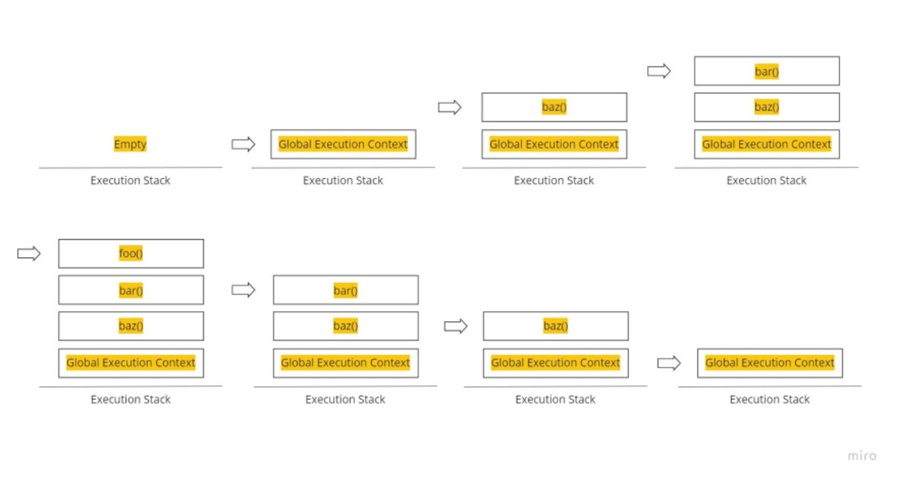
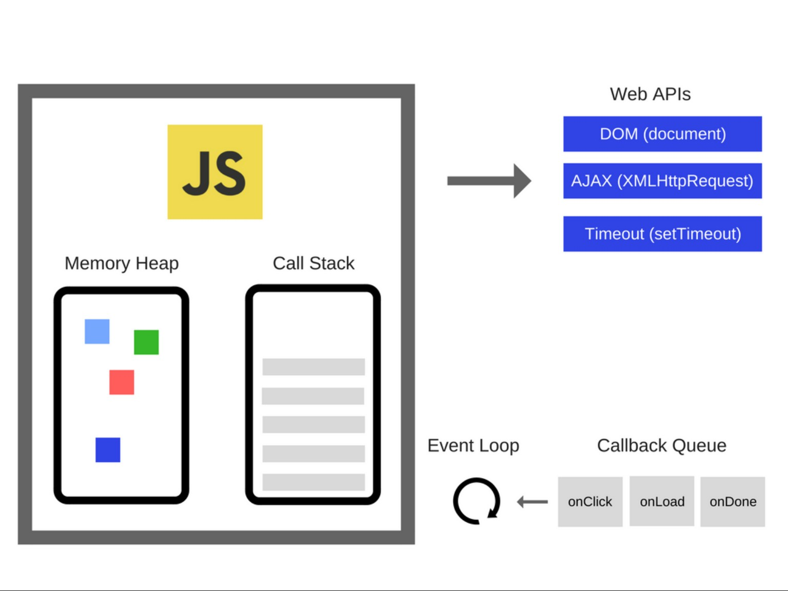
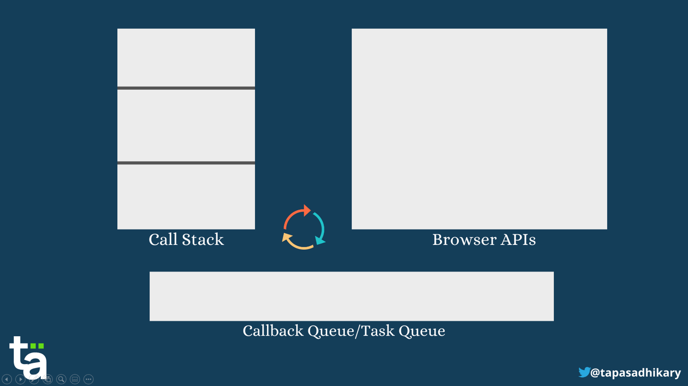

자바스크립트를 메인 언어로 사용하기로 마음먹은지 1년 6개월 정도가 지났다

하지만 아직도 자바스크립트에 대해 깊게 공부해본 경험이 없다

올해 하반기에는 자바스크립트에 대해 보다 깊고 명확하게 이해해 보려고 한다

이 포스팅은 [Modern Javascript Deep Dive](http://www.kyobobook.co.kr/product/detailViewKor.laf?ejkGb=KOR&barcode=9791158392239), [The Modern Javascript Tutorial](https://javascript.info/)을 기반으로 작성하려고 한다

오늘은 동기, 비동기에 대해 정리해보고자 한다

# 동기 처리와 비동기

함수를 호출하면 함수 코드가 평가되어 함수 `실행 컨텍스트`가 생성된다

이때 생성된 함수 실행 컨텍스트는 실행 컨텍스트 스택(콜 스택)에 푸시되고 함수코드가 실행된다

함수 코드의 실행이 종료되면 함수 실행 컨텍스트는 실행 컨텍스트 스택에서 팝되어 제거된다

```js
/* call stack */

console.log('global execution context');

function foo() {
  console.log('foo is executing');
  console.log('foo has finished executing');
}

function bar() {
  console.log('bar is executing');
  foo();
  console.log('bar has finished executing');
}

function baz() {
  console.log('baz is executing');
  bar();
  console.log('baz has finished executing');
}

baz();
console.log('program successfully executed');

// global execution context
// baz is executing
// bar is executing
// foo is executing
// foo has finished executing
// bar has finished executing
// baz has finished executing
// program successfully executed
```



여기서 중요한 사실은 **`자바스크립트 엔진은 단 하나의 콜 스택`**을 갖는다는 것이다

이는 함수를 실행할 수 있는 창구가 단 하나이며, 2개 이상의 함수를 동시에 실행할 수 없다는 것을 의미한다

콜스택의 최상위 요소인 '실행 중인 실행 컨텍스트'를 제외한 모든 실행 컨텍스트는 모두 태스크(task)들이다

태스크들은 현재 실행중인 실행 컨텍스트가 pop되어 콜스택에서 제거되면 비로소 실행되기 시작한다

이처럼 자바스크립트 엔진은 한 번에 하나의 태스크만 실행할 수 있는 `single thread`방식으로 동작한다

싱글 스레드 방식은 한 번에 하나의 태스크만 실행할 수 있기 때문에 처리 시간이 걸리는 태스크를 실행하는 경우 **블로킹(blocking, 작업 중단)**이 발생한다

예를 들어 `setTimeout`함수와 유사하게 일정 시간이 경과한 이후 콜백 함수를 호출하는 함수를 구현해 보도록 하자

```js
function sleep(callback, delay) {
  const delayUntil = Date.now() + delay;

  while (Date.now() < delayUntil) {
    callback();
  }
}

function foo() {
  console.log('foo');
}

function bar() {
  console.log('bar');
}

sleep(foo, 3 * 1000);
bar();

// foo * many times

// after 3sec or more
// bar
```

위와 같이 `bar`는 `sleep`에 의해 3초 이상(3초 + foo함수의 실행시간) 호출되지 못하는 블로킹(작업 중단) 상태가 된다

이처럼 현재 실행 중인 태스크가 종료할 때까지 다음에 실행될 태스크가 대기하는 방식을 **`동기(synchronous) 처리`**라고 한다

동기 처리를 하게되면 실행 순서가 보장되지만 앞선 태스크가 종료할 때까지 이후 태스크들이 블로킹된다는 단점도 분명하다

이번엔 `setTimeout`을 사용해 보도록 하자

```js
function foo() {
  console.log('foo');
}

function bar() {
  console.log('bar');
}

setTimeout(foo, 3 * 1000);
bar();

// bar
// after 3 sec
// foo
```

`setTimeout`함수는 앞서 살펴본 sleep함수와 유사하게 일정 시간이 경과한 후 콜백 함수를 호출하지만 `setTimeout`은 이후의 태스크를 블로킹하지 않고 곧바로 실행한다

이처럼 현재 실행 중인 태스크가 종료되지 않은 상태라해도 다음 태스크를 곧바로 실행하는 방식을 **`비동기(asynchronous) 처리`**라고 한다

비동기 처리 방식은 현재 실행 중인 태스크가 종료되지 않은 상태라 해도 다음 태스크를 곧바로 실행하므로 블로킹이 발생하지 않지만 태스크들의 실행 순서를 보장하지 않는 단점이 있다

위 예시에서 봤듯이 비동기 처리를 수행하는 비동기 함수는 전통적으로 콜백 패턴을 사용한다

하지만 비동기 처리를 위한 콜백 패턴은 콜백 지옥(callback hell)을 발생시켜 가독성을 나쁘게 하고, 비동기 처리 중 발생한 에러의 예외 처리가 곤란하며, 여러개의 비동기 처리를 한번에 처리하는 데도 한계가 있다

이를 계선한 것이 바로 `프로미스(Promise)`이다

> 타이머 함수인 `setTimeout`과 `setInterval`, `HTTP Request`, `Event handler`는 비동기 처리 방식으로 동작한다

이제 비동기 처리에 깊은 관계가 있는 이벤트 루프(event loop), 태스크 큐(task queue)에 대해 알아보자

# 이벤트 루프와 태스크 큐

자바스크립트의 특증 중 하나는 위에서도 언급했듯이 싱글 스레드로 동작한다는 것이다

하지만 브라우저가 동작하는 것을 보면 많은 태스크들이 동시에 처리되는 것 처럼 보여 우리를 혼동시킨다

예를 들어, HTML 요소가 애니메이션 효과를 통해 움직이면서 이벤트를 처리하기도 하고, HTTP 요청을 통해 서버로부터 데이터를 가지고 오면서 렌더링하기도 한다

이처럼 자바스크립트의 동시성(concurrency)을 지원하는 것이 바로 `이벤트 루프(event loop)`다



이벤트 루프는 브라우저에 내장되어 있는 기능 중 하나인데 보통 위와 같이 표현된다

1. **call stack / function execution stack**

소스코드 평가 과정에서 생성된 실행 컨텍스트가 추가되고 제거되는 스택 자료구조

함수를 호출하면 함수 실행 컨텍스트가 순차적으로 콜 스택에 push되어 순차적으로 실행된다<br />(즉, 선입후출(FILO, First in, Last out)의 구조를 가지고 있다)

자바스크립트 엔진은 단 하나의 콜 스택을 사용하기 때문에(싱글 스레드) 최상위 실행 컨텍스트가 종료되어 콜 스택에서 제거(pop)되기 전까지는 다른 어떤 태스크도 실행되지 않는다

2. **heap**

힙은 객체가 저장되는 메모리 공간으로 `memory heap`이라고도 불린다

콜 스택의 요소인 실행 컨텍스트는 힙에 저장된 객체를 참조한다

메모리에 값을 저장하려면 먼저 값을 저장할 메모리 공간의 크기를 결정해야 하는데 객체는 원시 값과는 달리 크기가 정해져 있지 않으므로 할당해야 할 메모리 공간의 크기를 런타임에 결정(동적 할당)해야 한다

따라서 객체가 저장되는 메모리 공간인 힙은 구조화되어 있지 않다는게 특징이다

이처럼 **콜 스택과 힙으로 구성되어 있는 자바스크립트 엔진**은 단순히 태스크가 요청되면 콜 스택을 통해 요청된 작업을 순차적으로 실행할 뿐이다

**비동기 처리에서 소스코드의 평가와 실행을 제외한 모든 처리는 자바스크립트 엔진을 구동하는 환경인 브라우저 또는 Node.js가 담당한다**

예를 들어, 비동기 방식으로 동작하는 setTimeout의 콜백 함수의 평가와 실행은 자바스크립트 엔진이 담당하지만 호출 스케줄링을 위한 타이머 설정과 콜백 함수의 등록은 브라우저 또는 Node.js가 담당한다

이를 위해 브라우저 환경은 태스크 큐(콜백 큐)와 이벤트 루프를 제공한다

3. **task queue / event queue, callback queue**

setTimeout이나 setInterval과 같은 비동기 함수의 콜백 함수 또는 이벤트 핸들러가 일시적으로 보관되는 영역이다

콜백 큐와 별도로 프로미스의 후속 처리 메서드의 콜백 함수가 일시적으로 보관되는 마이크로태스크 큐도 존재한다

이에 대해서는 나중에 좀 더 자세히 다뤄보도록 하자

4. **event loop**

이벤트 루프는 콜 스택에 현재 실행중인 실행 컨텍스트가 있는지 그리고 콜백 큐에 대기 중인 함수가 있는지 반복해서 확인한다

만약 **콜 스택이 비어있고 태스크 큐에 대기 중인 함수가 있다면 이벤트 루프는 순차적(선입 선출(FIFO, First in, First out))으로 콜백 큐에 대기 중인 함수를 콜 스택으로 이동시킨다**

이때 콜 스택으로 이동한 함수는 실행되는데 이는 **콜백 큐에 일시 보관된 함수들은 비동기 처리 방식으로 동작한다는 뜻이다**

이제 브라우저 환경에서 다음 예제가 어떻게 동작할지 상상해보자

```js
function f1() {
  console.log('f1');
}

function f2() {
  console.log('f2');
}

function main() {
  console.log('main');

  setTimeout(f1, 0);

  f2();
}

main();
```

0초 뒤에 `f1`이 실행된다면

```js
// main
// f1
// f2
```

'위와 같이 출력되는 것이 아닐까?' 싶지만 setTimeout의 지연시간이 4ms 이하인 경우 지연시간은 4ms로 지정된다 [ref](https://stackoverflow.com/questions/9647215/what-is-minimum-millisecond-value-of-settimeout)

따라서 출력은 아래와 같을 것이다



```js
// main
// f2
// f1
```

이를 좀 더 구체적으로 살펴본다면

1. 전역 코드가 평가되어 전역 실행 컨텍스트가 생성되고 콜 스택에 push된다

2. 전역 코드가 실행되기 시작하여 `main`함수의 실행 컨텍스트가 생성되고 실행된다

3. 콘솔에 `main`이 출력되고 `setTimeout`함수가 호출된다

4. `setTimeout`함수의 실행 컨텍스트가 생성되고 콜 스택에 push되어 현재 실행 중인 실행 컨텍스트가 된다<br />브라우저의 Web API(호스트 객체)인 타이머 함수도 함수이므로 실행 컨텍스트를 생성한다

5. `setTimeout`함수가 실행되면 콜백 함수를 호출 스케줄링하고 종료되어 콜 스택에서 pop된다<br />이때 호출 스케줄링, 즉 타이머 설정과 타이머가 만료되면 콜백 함수를 콜백 큐에 push하는 것은 브라우저의 역할이다

6. 브라우저가 수행하는 6-1, 자바스크립트 엔진이 수행하는 6-2는 병행 처리된다<br />
   <br />
   6-1. 브라우저는 타이머를 설정하고 타이머의 만료를 기다린다<br />
   4ms후 타이머가 만료되면 콜백 함수 `f1`가 콜백 큐에 push되어 대기상태가 된다<br />
   <br />
   6-2. `f2`함수가 호출되어 실행 컨텍스트가 생성되고 콜 스택에 push되어 현재 실행 중인 실행 컨텍스트가 된다<br />
   이후 콘솔에 `f2`이 출력되고, `f2`함수가 종료되어 콜 스택에서 pop된다<br />
   이때 브라우저가 타이머를 설정한 후 4ms가 경과했다면 `f1`함수는 아직 콜백 큐에서 대기 중이다

7. `main`함수의 실행 컨텍스트가 종료되고 콜 스택에서 팝된다<br />이로서 콜 스택에는 아무런 실행 컨텍스트가 존재하지 않게 된다

8. 이벤트 루프에 의해 콜 스택이 비어 있음이 감지되고 콜백 큐에서 대기 중인 콜백 함수 `f1`이 이벤트 루프에 의해 콜 스택에 push된다<br />다시 말해, 콜백 함수 `f1`의 실행 컨텍스트가 생성되고 콜 스택에 push되어 현재 실행중인 실행 컨텍스트가 되며, 이후 콘솔에 `f1`이 출력되고 `f1`함수가 종료되어 콜 스택에서 pop된다

이처럼 **비동기 함수인 `setTimeout`의 콜백 함수는 콜백 큐에 push되어 대기하다가 콜 스택이 비게되면 비로소 콜 스택에 push되어 실행된다**

**다시 말하지만 자바스크립트는 싱글 스레드 방식으로 동작한다**

**이때 싱글 스레드 방식으로 동작하는 것은 브라우저에 내장된 '자바스크립트 엔진'이지 브라우저 자체가 아님에 주의하자**

**만약 자바스크립트가 모두 자바스크립트 엔진에 의해 싱글 스레드 방식으로 동작한다면 자바스크립트는 비동기로 동작할 수 없다**

**즉, 브라우저는 멀티 스레드로 동작한다는 말이다**

브라우저는 자바스크립트 엔진 외에도 렌더링 엔진과 Web API를 제공한다

Web API는 ECMAScript 사양에 정의된 함수가 ㅇ나니라 브라우저에서 제공하는 API이며, DOM API와 타이머 함수, HTTP 요청(Ajax)와 같은 비동기 처리를 포함한다

## \*references

1. [What is the Execution Context, Execution Stack & Scope Chain in JS](https://dev.to/ahmedtahir/what-is-the-execution-context-execution-stack-scope-chain-in-js-26nc)

2. [Synchronous vs Asynchronous JavaScript – Call Stack, Promises, and More](https://www.freecodecamp.org/news/synchronous-vs-asynchronous-in-javascript/)
