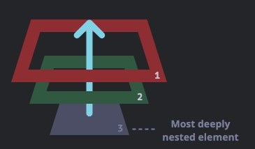

어떠한 동작에 특정 기능을 넣기 위해 우리는 이벤트를 사용한다

```html
<div onclick="alert('The handler!')">
  <em
    >If you click on <code>EM</code>, the handler on <code>DIV</code> runs.</em
  >
</div>
```

위 구조에서 `<div>`뿐 아니라 `<code>` 혹은 `<em>`을 클릭해도 이벤트는 발생한다

나는 `<div>`에 클릭이벤트를 넣었는데 어째서 다른 곳을 클릭해도 해당 이벤트가 동작하는 것일까?

# Bubbling

버블링이란 이벤트의 전파방식 중 하나이다

바다 깊은 곳에서 우리가 숨을 뱉는다고 상상해보자

그 공기방울들은 위로 점점 올라갈 것이다

이벤트도 공기방울들과 마찬가지로 자식요소에서 부모요소로 이벤트를 전파시킨다



```html
<style>
  body * {
    margin: 10px;
    border: 1px solid blue;
  }
</style>

<form onclick="alert('form')">
  FORM
  <div onclick="alert('div')">
    DIV
    <p onclick="alert('p')">P</p>
  </div>
</form>
```

위 예시에서 `<form>` 영역을 클릭하면 `alert('form')`이 실행된다

하지만, `<div>`나 `<p>` 영역을 클릭하게되면 모든 부모들의 `alert`도 실행된다

> 대부분의 이벤트는 버블링 된다
>
> 여기서 주목해야 될 단어는 '대부분(almost)'이다
>
> 대부분의 이벤트는 버블링되지만 `focus`같이 버블링되지 않는 이벤트도 있다

## event.target

(작성중..)

## \*references

- [Bubbling and capturing](https://javascript.info/bubbling-and-capturing)
