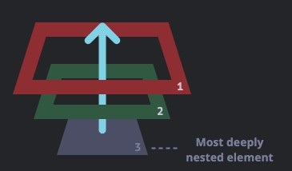
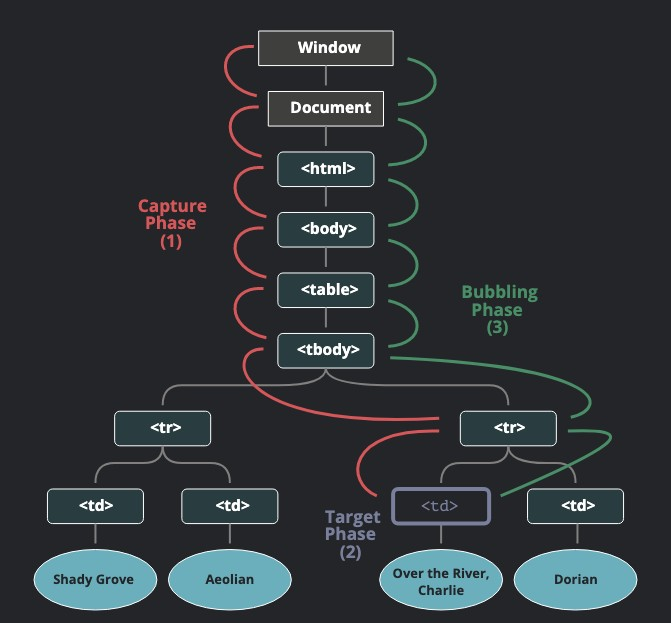

어떠한 동작에 특정 기능을 넣기 위해 우리는 이벤트를 사용한다

```html
<div onclick="alert('The handler!')">
  <em
    >If you click on <code>EM</code>, the handler on <code>DIV</code> runs.</em
  >
</div>
```

위 구조에서 `<div>`뿐 아니라 `<code>` 혹은 `<em>`을 클릭해도 이벤트는 발생한다

나는 `<div>`에 클릭이벤트를 넣었는데 어째서 다른 곳을 클릭해도 해당 이벤트가 동작하는 것일까?

# Bubbling

버블링이란 이벤트의 전파방식 중 하나이다

바다 깊은 곳에서 우리가 숨을 뱉는다고 상상해보자

그 공기방울들은 위로 점점 올라갈 것이다

이벤트도 공기방울들과 마찬가지로 자식요소에서 부모요소로 이벤트를 전파시킨다



```html
<style>
  body * {
    margin: 10px;
    border: 1px solid blue;
  }
</style>

<form onclick="alert('form')">
  FORM
  <div onclick="alert('div')">
    DIV
    <p onclick="alert('p')">P</p>
  </div>
</form>
```

위 예시에서 `<form>` 영역을 클릭하면 `alert('form')`이 실행된다

하지만, `<div>`나 `<p>` 영역을 클릭하게되면 모든 부모들의 `alert`도 실행된다

> 대부분의 이벤트는 버블링 된다
>
> 여기서 주목해야 될 단어는 '대부분(almost)'이다
>
> 대부분의 이벤트는 버블링되지만 `focus`같이 버블링되지 않는 이벤트도 있다

## event.target

이벤트가 정확히 어디서 발생했는지 등에 대한 자세한 정보를 얻을 수 있다

`event.target`과 `event.currentTarget(this)`의 차이점을 정확히 알지 못하는 경우가 있는데,

`event.target`은 실제로 이벤트가 시작된 요소를 담고 있으며,

`event.currentTarget(this)`은 현재 실행 중인 핸들러가 할당된 요소를 참조한다

```html
<style>
  form {
    background-color: green;
    position: relative;
    width: 150px;
    height: 150px;
    text-align: center;
    cursor: pointer;
  }

  div {
    background-color: blue;
    position: absolute;
    top: 25px;
    left: 25px;
    width: 100px;
    height: 100px;
  }

  p {
    background-color: red;
    position: absolute;
    top: 25px;
    left: 25px;
    width: 50px;
    height: 50px;
    line-height: 50px;
    margin: 0;
  }

  body {
    line-height: 25px;
    font-size: 16px;
  }
</style>

<form id="form">
  FORM
  <div>
    DIV
    <p>P</p>
  </div>
</form>

<script>
  form.onclick = function(event) {
    event.target.style.backgroundColor = 'yellow';
    setTimeout(() => {
      alert('target = ' + event.target.tagName + ', this=' + this.tagName);
      event.target.style.backgroundColor = '';
    }, 0);
  };
</script>
```

위 예시를 보면 FORM > DIV > P의 구조로 되어있는데

1. P 클릭: target = P, currentTarget(this) = FORM

2. DIV 클릭: target = DIV, currentTarget(this) = FORM

3. FORM 클릭: target = FORM, currentTarget(this) = FORM

위와 같이 `currentTarget(this)`는 실제 이벤트가 동작하는 FORM인 것을 알 수 있다

## Stopping bubbling

이벤트의 버블링은 `<html>` 요소를 거쳐 `document` 객체 혹은 `window` 객체를 만날 때까지 위로 거슬러 올라간다

이러한 버블링을 의도적으로 중단하기 위해서는 `event.stopPropagation()`을 사용하면 된다

```html
<body onclick="alert(`the bubbling doesn't reach here`)">
  <button onclick="event.stopPropagation()">Click me</button>
</body>
```

위 버튼을 눌러도 버블링은 중단되어 `<body>`에 있는 alert 이벤트는 동작하지 않는다

> ⚠️ 꼭 필요한 경우를 제외하고는 버블링을 막지말자
>
> 버블링을 통해 수집된 이벤트들은 `window` 객체에서 다양하게 활용 될 수 있다
>
> 예를 들어, 사람들이 페이지에서 어디를 클릭했는지 등의 행동 패턴을 분석할 때 버블링이 막혀있다면
>
> 해당 부분은 dead zone이 되어 버린다
>
> `stopPropagation`을 사용해야하는 영역은 대부분 커스텀 이벤트를 통해 해결할 수 있으니 가능하면 사용하지 않도록 하자

> 🍪 stopImmediatePropagation
>
> `stopPropagation`은 해당 이벤트의 버블링과 캡처링을 중단
>
> `stopImmediatePropagation`은 해당 이벤트 핸들러만 실행하고 이후에 실행되는 이벤트 핸들러와 이벤트 전파를 모두 막는다

# Capturing

이벤트 캡처링은 실무 상에서는 거의 사용하지 않지만 때로는 매우 유용하다

`DOM Events`는 3단계로 구분지을 수 있는데

1. `Capturing phase`: 이벤트가 하위 요소로 전파 됨

2. `Target phase`: 이벤트가 실제 타겟 요소에 전달 됨

3. `Bubbling phase`: 이벤트가 상위 요소로 전파 됨

아래의 사진은 `<td>` 태그를 클릭했을 때 이벤트가 전파 및 전달되는 과정이다



캡처링 단계를 이용할 일은 흔치 않기 때문에 위에서는 줄곳 버블링에 대해서만 다뤘다

실제로 `on<event>` 프로퍼티나 `addEventListener(event, handler)`를 사용하면 이 핸들러는 `Target phase` 혹은 `Bubbling phase`에서만 동작한다

캡처링 단계에서 이벤트를 잡아내려면 `capture: true`를 해줘야 한다

```js
elem.addEventListener(event, handler, { capture: true });
// or, just "true" is an alias to {capture: true}
elem.addEventListener(event, handler, true);
```

캡처링은 옵션에 해당하기 때문에 해당 파라미터를 비워두면 기본적으로 `false`로 동작한다

캡처링과 버블링의 차이를 코드로 살펴보면 다음과 같다

```html
<style>
  body * {
    margin: 10px;
    border: 1px solid blue;
  }
</style>

<form>
  FORM
  <div>
    DIV
    <p>P</p>
  </div>
</form>

<script>
  for (let elem of document.querySelectorAll('*')) {
    elem.addEventListener(
      'click',
      e => alert(`Capturing: ${elem.tagName}`),
      true
    );
    elem.addEventListener('click', e => alert(`Bubbling: ${elem.tagName}`));
  }
</script>
```

> ⚠️ `removeEventListener`를 사용할 때에는 같은 phase헤 해줘야 한다
>
> 캡처링 단계의 이벤트 핸들러를 제거하고 싶을 때는 `removeEventListener(event, handler, true)`로 제거해줘야 한다

> ⚠️ 동일 요소, 동일 단계에 설정한 이벤트 핸들러는 순서대로 실행된다
>
> elem.addEventListener("click", e => alert(1));
>
> elem.addEventListener("click", e => alert(2));
>
> 위의 경우 `alert(1) → alert(2)`순서를 반드시 보장한다

## \*references

- [Bubbling and capturing](https://javascript.info/bubbling-and-capturing)

- [stopPropagation vs stopImmediatePropagation 제대로 이해하기](https://medium.com/오늘의-프로그래밍/stoppropagation-vs-stopimmediatepropagation-제대로-이해하기-75edaaed7841)
