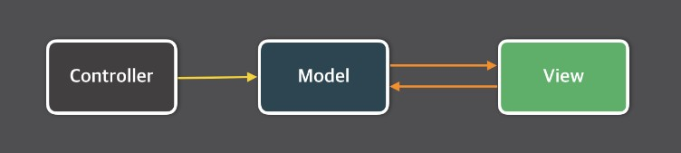
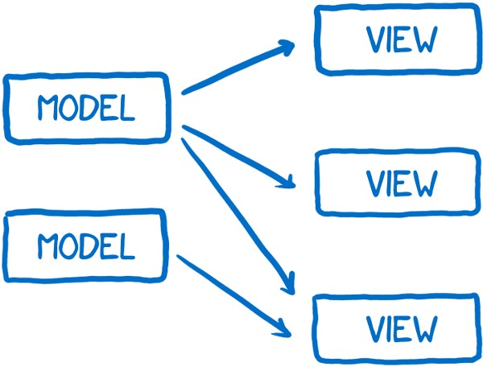
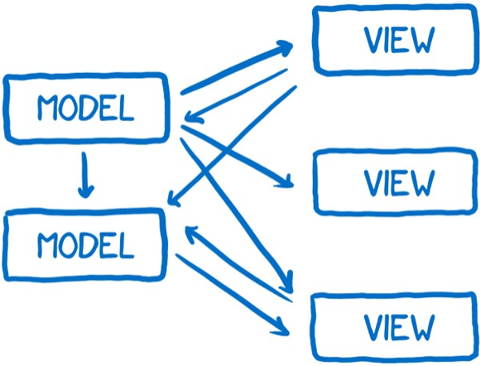
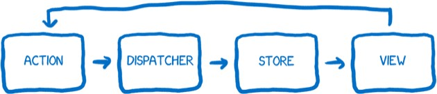
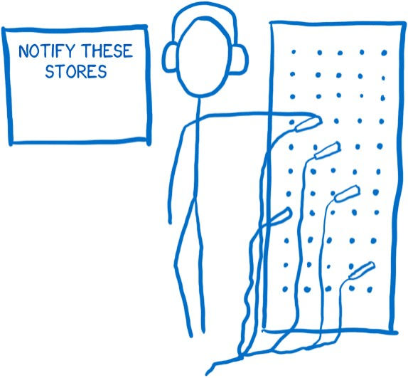

React를 공부하다보면 자연스럽게 MVC와 Flux에 대해 듣게된다

그 중 오늘은 Flux에 대해 알아보도록 하자

# Flux의 출현배경

기존에 사용되고 있던 MVC 패턴은 Model에 데이터를 정의해두고, Controller를 이용해 Model의 데이터를 CRUD하고, 변경된 데이터는 View layer에 출력하여 사용자에게 전달하였다

이 패턴의 문제점은 어플리케이션의 규모가 커질수록 데이터의 흐름이 매우 복잡해진다는 점이다

이 문제점 중 가장 잘 알려져 있는 것이 facebook notification 버그다

facebook에 로그인 했을 때 화면 위의 메세지 아이콘에 알림이 떠 있지만, 그 메세지 아이콘을 클릭해서 들어가보면 아무런 메세지가 없던 적이 있었을 것이다

알림은 사라지겠지만 몇 분 뒤 알림이 다시 나타나고 여전히 아무런 메세지도 나타나지 않는다

이 사이클이 계속반복되는 버그가 바로 facebook notification 버그였다

facebook팀은 이 버그를 고쳤지만 얼마동안 지나고나면 다시 나타났다

이렇게 문제가 생기고 고치는 뫼비우스의 띠는 끝이 보이지 않았다

그래서 facebook에서는 단기적인 해결책이 아닌 시스템을 더욱 예측가능하게 만들어 문제점을 완전히 없애고 싶어했다

# 근본적인 문제점

facebook이 찾은 근본적인 문제점은 `데이터 흐름`에 있었다

이전에는 데이터를 가지고 있는 model이 rendering하기 위해 view layer로 데이터를 보냈다

사용자와의 상호작용이 view를 통해 일어나기 때문에 사용자의 입력에 따라 가끔 view가 model을 업데이트해야 할 필요가 있었다

이러한 일들이 매우 많이 일어난다면 마치 산사태처럼 아주 많은 변경들이 일어나게되고 이 변경들은 예측불가능할 것이다

이런 변경들이 비동기적으로 일어나거나 하나의 변경이 다수를 변경시킬 수도 있으므로 이는 데이터 흐름을 디버그하기 어렵게 만든다

# 해결책

이를 해결하기 위해 facebook은 다른 종류의 아키텍처를 시도하기로 결정했다

이 구조에서 데이터는 단방향으로만 흐르고, 새로운 데이터를 넣으면 처음부터 흐름이 다시 시작된다

이 아키텍처를 `Flux`라고 부른다

이제부터 위 다이어그램의 구성요소들을 하나하나 살펴보도록 하자

## Action

액션 생성자(the action creator)는 모든 변경사항과 사용자와의 상호작용이 거쳐가야 하는 액션의 생성을 담당하고 있다

언제든 어플리케이션의 상태를 변경하거나 view를 업데이트하고 싶다면 액션을 생성해야만 한다

액션 생성자가 하는 일은 마치 전보기사(telegraph operator)와 같다

무슨 메세지를 보낼지 알려주는 액션 생성자는 나머지 시스템이 이해할 수 있는 양식(format)으로 바꿔준다 
(마치 전보기사가 알파벳을 기계들이 처리할 수 있는 모스부호로 바꾸는 것 처럼)

액션 생성자는 타입(type)과 페이로드(payload)를 포함한 액션을 생성한다

타입은 시스템에 정의된 액션들(일반적으로 상수들) 중의 하나이다

일단 액션 생성자가 액션 메세지를 생성한 뒤에는 디스패처(dispatcher)에게 넘겨준다

## Dispatcher

디스패처는 기본적으로 콜백(callback)이 등록되어 있는 곳이다

이것은 마치 전화 교환대에서 교환원이 일하는 것과 같다 
(전화 교환대에서는 등록된 모든 전화들과의 연결이 가능하다)

디스패처는 액션을 보낼 필요가 있는 모든 스토어(store)를 가지고 있고, 액션 생성자로부터 액션이 넘어오면 여러 스토어에 액션을 보낸다

이 처리는 동기적으로(synchronously) 실행된다

만약 스토어들 사이에 의존성(dependency)이 있어서 하나를 다른 것보다 먼저 업데이트해야 한다면 `async/await`를 사용하여 디스패처가 적절히 처리하도록 할 수 있다

Flux의 디스패처가 다른 아키텍처들과 조금 다른점이 있는데 이는 바로 액션 타입과는 상관없이 등록된 모든 스토어에 보내진다는 것이다

즉, 스토어가 특정 액션만 구독(subscribe)하지 않고 모든 액션을 일단 받은 뒤 처리할지 말지를 결정한다는 뜻이다

## Store

스토어는 어플리케이션 내의 모든 상태, 그리고 관련된 로직을 가지고 있다

스토어는 마치 모든 것을 관리하는 관리자와 같다

모든 상태 변경은 반드시 스토어에 의해서 결정되어야만 하며, 상태 변경을 위한 요청을 스토어에 직접 보낼 순 없다

스토어에는 setter가 존재하지 않으므로 상태 변경을 요청하기 위해서는 반드시 모든 정해진 절차를 따라야만 한다

즉, 무조건 액션 생성자와 디스패처 파이프라인을 거쳐서 액션을 보내야 한다

앞에서 설명했듯이, 스토어가 디스패처에 등록되어 있다면 모든 액션을 받게 될 것이다

스토어의 내부에서는 보통 `switch statement`를 사용해서 처리할 액션과 무시할 액션을 결정하게 된다

만약 처리가 필요한 액션이라면 주어진 액션에 따라 무엇을 할지 결정하고 상태를 변경한다

스토어에 상태변경이 완료되면 변경 이벤트(change event)를 내보낸다

이 이벤트는 컨트롤러 뷰(the controller view)에 상태가 변경됐다는 것을 알려준다

## View

## \*references

1. [Flux로의 카툰 안내서](https://bestalign.github.io/translation/cartoon-guide-to-flux/)

2. ['데이터가 폭포수처럼 흘러내려' React의 flux 패턴](https://www.huskyhoochu.com/flux-architecture/)
