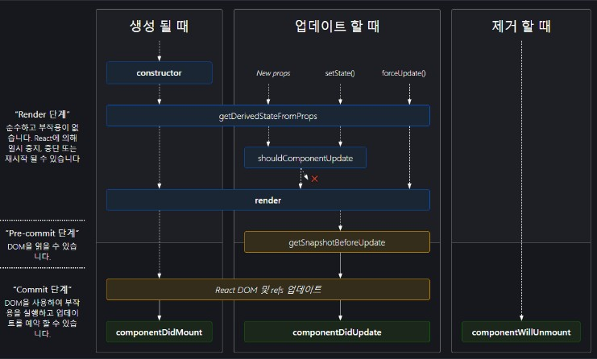

리엑트를 사용하면서 당연하게 사용해왔던 훅(hooks)들이 정확히 어떤 시점에서 실행이되고 어떤상황에서 쓰여야되는지는 잘 몰랐던 것 같다

이참에 이를 확실히 정리하고 기초를 다지기위해 이렇게 글로써 정리를 하려한다

# 리엑트 훅

훅이 어떤 기능을 하는지 알아가기 전에 훅이 무엇인지 정확하게 짚고 넘어갈 필요가 있다

> Hooks are a new addition in React 16.8. They let you use state and other React features without writing a class.

훅은 간단히 말하면 상태(state) 혹은 리엑트의 다른 기능을 클래스로 작성하지 않고 사용하기 위해 탄생했다

> There are no plans to remove classes from React. ...... Hooks don’t replace your knowledge of React concepts. Instead, Hooks provide a more direct API to the React concepts you already know: props, state, context, refs, and lifecycle. As we will show later, Hooks also offer a new powerful way to combine them.

하지만 리엑트는 공식적으로 클래스형 개발방식을 리엑트 내에서 제거할 생각이 없다고 말한다

그렇기 때문에 우리는 클래스로 작성된 리엑트에 대해 좀 더 깊이 알 필요가 있다는 점을 알 수 있다

## 그래서 훅은 뭔가요?

> Hooks are functions that let you “hook into” React state and lifecycle features from function components.

훅은 함수 컴포넌트에서 react state와 lifecycle을 연동(hook into)할 수 있게 해주는 함수다

## 훅의 사용 규칙

1. 최상위(at the top level)에서만 훅을 호출해야 한다 당연히 반복문, 조건문, 함수내에서 훅을 실행하면 안된다

2. React 함수 컴포넌트 내에서만(혹은 커스텀 훅 내에서) 훅을 호출해야 한다

# 라이프사이클 메서드와 훅

> The Effect Hook, useEffect, adds the ability to perform side effects from a function component. It serves the same purpose as componentDidMount, componentDidUpdate, and componentWillUnmount in React classes, but unified into a single API.

`useEffect`는 함수 컴포넌트 내에서 react class의 `componentDidMount`, `componentDidUpdate`, `componentWillUnmount`을 하나의 API로 통합된 것이다

위 이미지에서 알 수 있듯이 리엑트는 크게 `생성될 때`, `업데이트 할 때`, `제거할 때`, 세 가지 상황을 기준으로 나뉜다 [이미지 출처](https://projects.wojtekmaj.pl/react-lifecycle-methods-diagram/)

> **👀 근데 리엑트는 언제 업데이트 될까?**
>
> 리엑트가 업데이트 되는 경우는
>
> 1. `props`가 바뀔 때
>
> 2. `state`가 바뀔 때
>
> 3. `부모 컴포넌트(parent component)`가 리렌더링 될 때
>
> 이렇게 세 가지 경우다

위 라이프 사이클 이미지에서 알 수 있듯이 훅과 라이프 사이클은 상호 보완적이지만 서로를 완벽하게 커버해주지는 못한다

아래의 표를 확인해보도록 하자

|        구분         |      Lifecycle methods       |    Lifecycle Hooks     |
| :-----------------: | :--------------------------: | :--------------------: |
|      도입시점       | 초기 리엑트 버전에서 소개 됨 | 2018년에 새롭게 등장함 |
|     ECMAScript      |             ES5              |          ES6           |
|        기반         |      클래스형 컴포넌트       |    함수형 컴포넌트     |
|  constructor 유무   |    초기화 시 반드시 사용     |     사용하지 않음      |
| State 업데이트 방법 |  this로 바인드하여 업데이트  | setter 함수로 업데이트 |

## 라이프 사이클 메서드

라이프 사이클 메서드 중 중요한 메서드들을 살펴보도록 하자

### render()

`render()`메서드는 클래스형 컴포넌트 안에서만 사용되며, 이는 컴포넌트의 UI 렌더링을 처리한다

이 메서드는 `생성될 때(mounting)`, `업데이트 할 때(updating)` 실행되며 UI로 보여지는 JSX를 리턴한다

`render()` 메서드 안에서는 `state`를 수정할 수 없다는 점이 특징이다

### componentDidMount()

컴포넌트가 생성이 되었다면 `componentDidMount()`가 실행된다

이 안에서는 data fetching API를 불러오는 등을 하기에 적합한 메서드다

이 안에서는 `state`를 변경할 수 있지만 성능 저하가 발생할 수 있으므로 주의하여야 한다

### componentDidUpdate()

이 메서드는 업데이트가 발생하는 즉시 호출된다

일반적으로는 `props`나 `state`의 변경에 대응하여 DOM을 업데이트하는 메서드라고 생각하면 된다

`props`나 `state`의 변화를 확인할 수 있는 상태에서 `setState()`를 사용하는 것을 권장한다 (잘못된 사용으로 무한루프에 빠질 수 있기 때문에 조심해야 한다)

### componentWillUnmount()

컴포넌트가 제거될 때 이 메서드가 호출된다

타이머의 제거, 저장소의 캐시 제거, API 호출의 취소 등 cleanup action을 하기 적합한 메서드다

 

훅에 대해서는 따로 사용법을 정리하지는 않겠다

[그보다 훅을 사용하면서 주의해야할 점](https://alpaca92.github.io/react/React-Hooks-사용-시-주의할-점들)에 대해 정리해둘 예정이니 이를 확인해보기 바란다

## \*references

1. [Introducing Hooks](https://reactjs.org/docs/hooks-intro.html)

2. [[JS]useEffect를 통한 React Hooks의 Lifecycle 관리](https://krpeppermint100.medium.com/js-useeffect를-통한-react-hooks의-lifecycle-관리-3a65844bcaf8)

3. [리엑트 핸드북: 25. LifeCycle Method](https://react.vlpt.us/basic/25-lifecycle.html)

4. [React - Lifecycle Methods vs Hooks](https://medium.com/crossml/react-lifecycle-methods-vs-hooks-6acf5e049f64)
